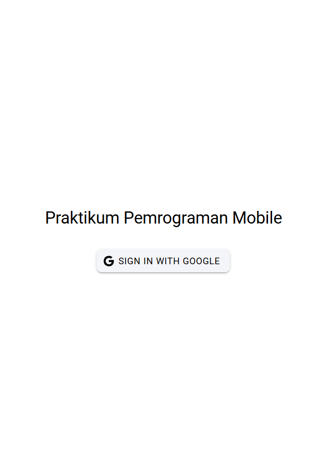
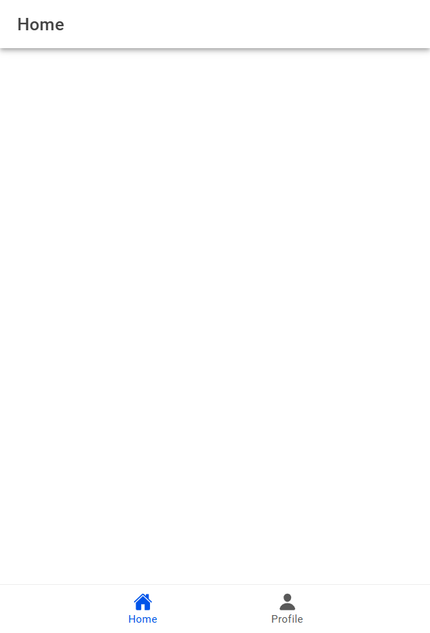
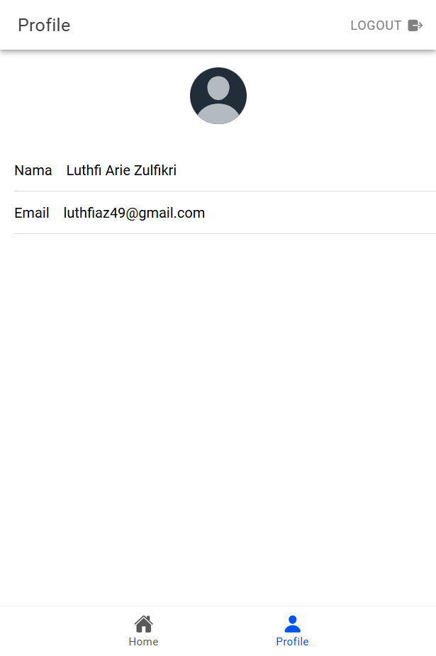

# Tugas 9 - Pertemuan 10

- **Nama** : Luthfi Arie Zulfikri
- **NIM** : H1D022061
- **Shift Lama** : A
- **Shift Baru** : A

---

# Proses Login

### **1. Halaman Login**

  

Pada halaman ini, pengguna dapat memulai proses login dengan menekan tombol **"Sign In with Google"**.

**Proses**:

- Saat tombol ditekan, fungsi `loginWithGoogle` dipanggil.
- Aplikasi memulai proses autentikasi Google dengan inisialisasi `GoogleAuth` menggunakan `clientId`.
- Pengguna diminta memilih akun Google untuk login.
- Setelah pengguna memilih akun, aplikasi mendapatkan `idToken` yang digunakan untuk membuat kredensial Firebase (`GoogleAuthProvider.credential`).
- Kredensial tersebut digunakan untuk masuk ke Firebase (`signInWithCredential`).
- Jika berhasil, data pengguna seperti nama, email, dan foto profil disimpan di `authStore.user`, dan pengguna diarahkan ke halaman **Home**.

### **2. Halaman Home**

  

Setelah login berhasil, pengguna diarahkan ke halaman **Home**. Tab navigasi di bagian bawah memungkinkan pengguna berpindah antara halaman **Home** dan **Profile**.

**Proses**:

- Middleware pada router memastikan hanya pengguna yang telah login dapat mengakses halaman ini. Jika pengguna belum login, mereka diarahkan kembali ke halaman **Login**.
- Halaman ini dirancang sebagai pusat navigasi utama, memanfaatkan komponen `IonTabs`.

### **3. Halaman Profile**

  

Pada halaman ini, informasi akun pengguna seperti nama, email, dan foto profil ditampilkan. Tombol **Logout** memungkinkan pengguna keluar dari aplikasi, menghapus sesi autentikasi, dan mengarahkan mereka kembali ke halaman **Login**.

**Proses**:

- Data profil pengguna diambil dari `authStore.user`, yang diperbarui secara real-time melalui `onAuthStateChanged`.
  - Nama pengguna: `user.displayName`
  - Email pengguna: `user.email`
  - Foto profil: `user.photoURL`
- Jika foto profil tidak tersedia, aplikasi menampilkan avatar default menggunakan logika `handleImageError`.
- Tombol **Logout** memanggil fungsi `logout`, yang:
  - Memanggil `signOut` untuk keluar dari Firebase.
  - Memanggil `GoogleAuth.signOut` untuk keluar dari sesi Google.
  - Mengatur `authStore.user` menjadi `null` dan mengarahkan pengguna ke halaman **Login**.
